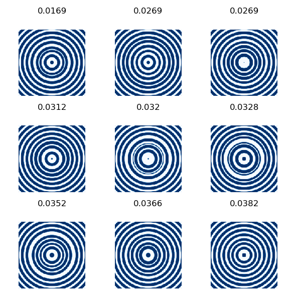

# ACSPhot23Suppl
Supplementary materials for just submitted article: Photonic Structures Optimization Using Highly Data-Efficient Deep Learning: Application To Nanofins And Annular Groove Phase Masks


# Launching on your system

If you cannot access a cluster with **slurm** workload manager, I recommand you just switch all `sbatch` instances to `bash` to run scripts locally. You will certainly want to adapt a bit those scripts but everything should work out of the box.

The `project.yml` will give these designs for 10 epochs and the seed.
```bash
python scripts/run_surrogate.py -project project.yml -epochs 10
```

